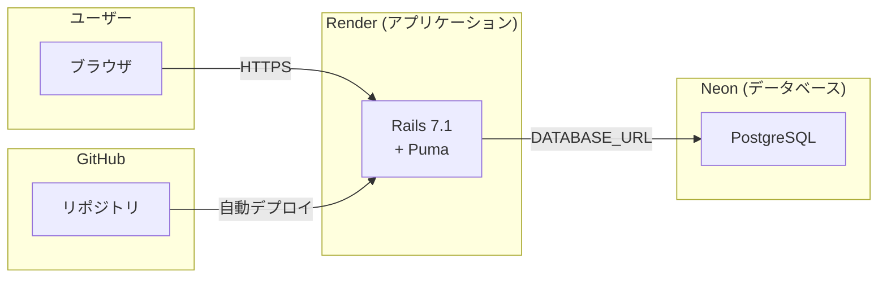

# Stretch_mini_app

## 公開URL
https://stretch-mini-app.onrender.com

## アプリを作った理由
### どうしてこのアプリを作ろうと思ったのか
自分が長時間座りっぱなしで身体もすぐ固くなってしまい、
定期的に整体院に行っているのだが、

そもそも常日頃から気にかけてストレッチをして身体を柔らかくしていれば、
整体院に行かなくて済むのでは？

でも、面倒くさいしいいや

となってばかりの日々を送っております。

そんな自分と同じような方々に向けて気軽にストレッチが出来るようになるアプリを作ろうと思いました。

### どんな課題を解決したかったのか

20~30代のデスクワーカー・ゲーマーで、肩こり、腰痛に悩んでいる人が、

それでも

「長時間座りっぱなしで身体が凝り固まってしまる。」
「わざわざ移動したり準備してまでストレッチしたくない。」
「続かない。」

という悩みを解決していきたい。


## できること（機能一覧）
- 気になる部位を選択式で表示
- ストレッチの一覧表示
- 部位別のフィルタリング
- ストレッチの詳細表示
- カウントダウン（スタート / 終了するボタン）
- 記録の登録
- 記録一覧表示
- カレンダーの表示

## 画面遷移図
https://www.figma.com/board/boSuNcBkBhLk55tgiSaTRI/stretch_mini_app_pages?node-id=0-1&t=QVdDUyHO4LukTTWO-1

## 技術スタック
| カテゴリ | 技術 |
| ---- | ---- |
| Backend | Ruby on Rails 7.2.3 |
| Database | PostgreSQL |
| CSS | Tailwind CSS |
| 開発環境 | Docker Compose |
| 本番環境 | Render(Free) + Neon(Free) |


## アーキテクチャ



## 工夫した点・苦労した点
- 環境構築
- データベースの設計
- デプロイ時のトラブルシューティング
- UI/UXの改善
- カウントダウン機能の実装
- （具体的なエピソードを書くと良い）

## 今後の改善ポイント
- ユーザー登録・ログイン機能
- DaisyUIの実装(Sprockets と Tailwindcssの実装状況を見直し)
- 画像表示のエラーハンドリング（画像がない場合にデフォルト画像を代わりに表示させる）

## 開発環境のセットアップ
```bash
# リポジトリをクローン
git clone https://github.com/your-username/your-app.git
cd your-app

# 依存関係をインストール
bundle install

# データベースのセットアップ
rails db:create db:migrate db:seed
